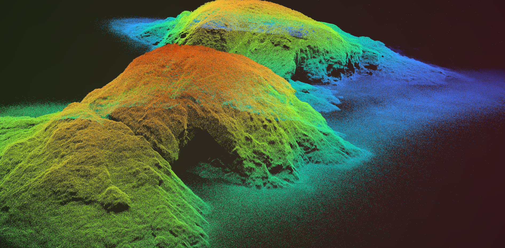
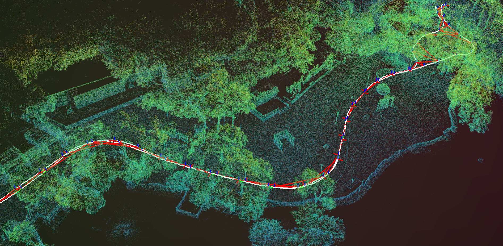
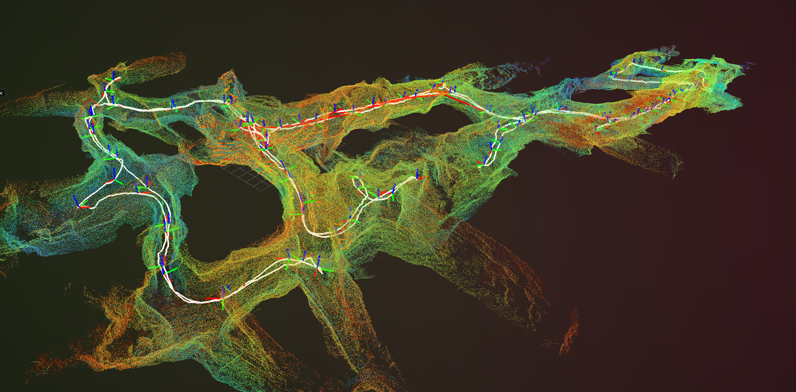
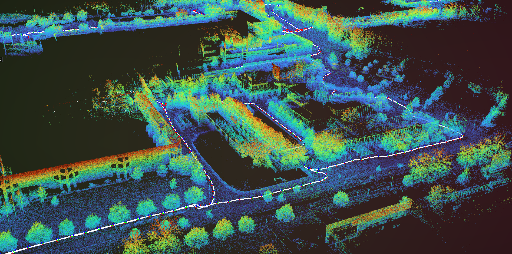
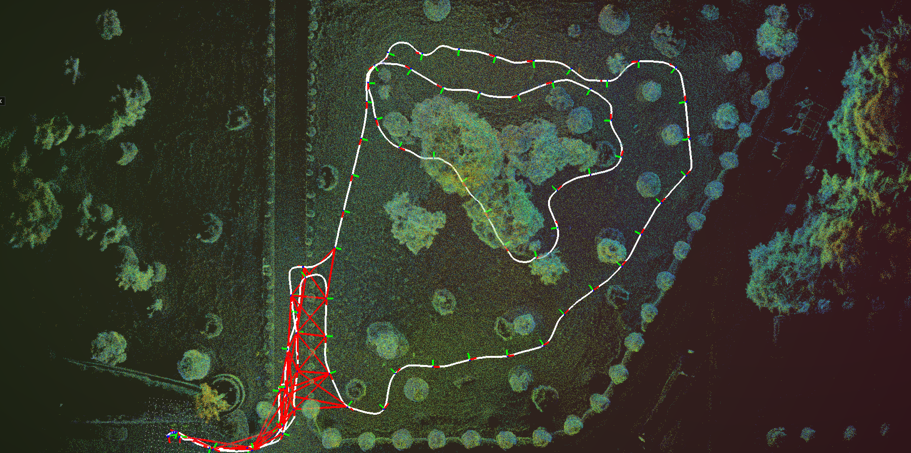
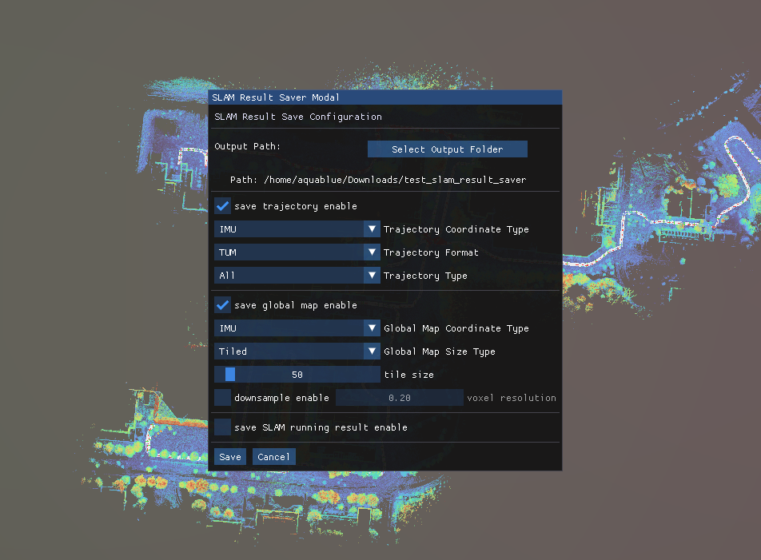
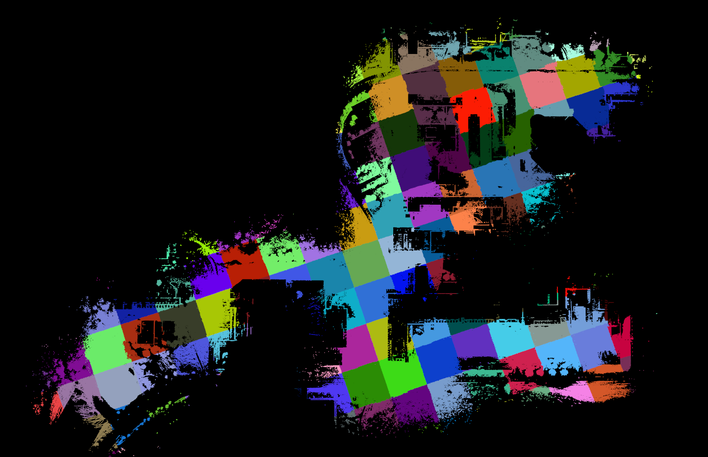

<p align="center">
  
</p>
<h2 align="center">Robust Lidar-based Odometry and Mapping</h2>

<p align="center">
  <!-- Bilibili 视频 -->
  <a href="https://space.bilibili.com/82127930/lists?sid=6240305&spm_id_from=333.788.0.0">
    
  </a>
  <!-- ROS1 -->
  
  <!-- ROS2 -->
  
  <!-- License -->
  
</p>

<p align="center">
  
</p>

kilo-map 是一个基于激光雷达的实时 SLAM 系统，具有以下特性：

- **紧耦合 ESKF 前端**：通过误差状态卡尔曼滤波器（ESKF）融合激光雷达与 IMU 数据。采用高斯体素地图增量式地维护带有不确定度的特征（平面特征与 NDT 变体特征），在结构化与非结构化场景中均能有效提升特征利用率。

- **因子图后端优化**：基于 Ceres 的因子图优化框架，紧密耦合回环检测约束与里程计因子，有效消除全局累积漂移。[small_gicp](https://github.com/koide3/small_gicp) 与 [KISS-Matcher](https://github.com/MIT-SPARK/KISS-Matcher) 作为回环验证模块，进一步提升匹配精度。

- **实时可视化**：基于 [Iridescence](https://github.com/koide3/iridescence) 构建，提供实时三维可视化与调试功能。支持输出前端与后端轨迹用于算法评估，并提供全局地图（单幅全局地图或分块地图）的保存功能，便于定位系统使用。

- **跨平台支持**：同时支持 ROS 1 与 ROS 2，已在多种激光雷达传感器的公开数据集上完成验证。各平台与传感器的 YAML 配置文件结构基本一致，几乎无需额外调参。

<p align="center">
  
  
  
  
</p>


# Prerequisites

本项目同时支持 **ROS 1** 与 **ROS 2**，已在以下发行版完成测试（***melodic***、***noetic***、***foxy***）。在 Ubuntu 22.04 与 24.04 上的 ROS 2 发行版（如 ***Humble***、***Jazzy***）理论上也可直接编译运行。

所有第三方库与 ROS 消息包已集成在本仓库中。你只需通过 apt 安装以下系统依赖：

```bash
# 必需
sudo apt update && sudo apt install -y libeigen3-dev libpcl-dev libgoogle-glog-dev libgflags-dev libyaml-cpp-dev libboost-filesystem-dev libboost-system-dev libtbb-dev liblz4-dev libceres-dev libglm-dev libglfw3-dev

# 可选
sudo apt install -y libpng-dev libjpeg-dev libassimp-dev
```


# Build

```bash
cd ~/kilo_map_ws/src
git clone https://github.com/ouguangjun/kilo-map.git
cd ..

# ROS 1
catkin_make # 或 catkin build

# ROS 2
colcon build
```


# Run

## Public Dataset

本系统已在 NCLT、SuperLoc、m3dgr、diter 等公开数据集上完成验证。你可以下载相应数据集并使用对应的 launch 文件进行测试（需确保 YAML 配置中的激光雷达类型、话题及外参与数据集匹配）。

以四足机器人 [legkilo dataset](https://github.com/ouguangjun/legkilo-dataset) 为例：

```bash
# ROS 1
source devel/setup.bash
roslaunch legkilo legkilo_go1_velodyne.launch
rosbag play slope.bag

# ROS 2
source install/setup.bash
ros2 launch legkilo legkilo_go1_velodyne.py
# 可使用 rosbags-convert 将 ROS 1 bag 转换为 ROS 2 格式
ros2 bag play ./slope_ros2
```

## Custom Dataset

若需使用自有数据集，请务必确认以下 YAML 参数已正确配置：

1. **`lidar_topic`** / **`imu_topic`**：激光雷达与 IMU 数据的 ROS 话题名称。
2. **`lidar_type`**：激光雷达型号。当前支持 `velodyne`、`ouster`、`hesai`、`livox`。如需新增类型，请参考 `legkilo/src/preprocess/lidar_processing.h`。
3. **`time_scale`**：将激光雷达单点原始时间戳转换为秒的缩放因子（例如纳秒级时间戳设为 `1e-9`，微秒级设为 `1e-6`）。该参数因激光雷达型号及驱动配置而异，同一传感器在不同驱动下也可能不同。
4. **`sensor_type`**：融合模式。常规激光雷达-IMU 场景使用 `LIO` 即可。
5. **`extrinsic_T`** / **`extrinsic_R`**：IMU 到激光雷达的外参变换（平移向量与旋转矩阵）。

# Save Map
<p align="center">
  
  
</p>

运行结束后，可通过可视化界面左上角的 **`Save Result`** 按钮保存全局地图与轨迹。

# Related Publications

本项目源自以下论文，但已进行大幅重构与重新设计，并非原文的直接实现。

<details>
<summary>Leg-KILO (RA-L 2024)</summary>

```bibtex
@ARTICLE{legkilo,
  author={Ou, Guangjun and Li, Dong and Li, Hanmin},
  journal={IEEE Robotics and Automation Letters}, 
  title={Leg-KILO: Robust Kinematic-Inertial-Lidar Odometry for Dynamic Legged Robots}, 
  year={2024},
  volume={9},
  number={10},
  pages={8194-8201},
  doi={10.1109/LRA.2024.3440730}
}
```
</details>

# Contact

如有疑问，请在 GitHub 提交 issue 或发送邮件至 [ouguangjun98@gmail.com](ouguangjun98@gmail.com)。

如果你有改善的想法或建议，欢迎提交 PR 或联系我！

# Maintainers

<a href="https://github.com/ouguangjun">
  
</a>

# License

本项目基于 MIT 许可证开源 - 详见 [LICENSE](LICENSE) 文件。

# Acknowledgments

感谢以下开源项目：

- [Iridescence](https://github.com/koide3/iridescence) — 实时三维可视化
- [small_gicp](https://github.com/koide3/small_gicp) — 点云配准，用于回环验证
- [KISS-Matcher](https://github.com/MIT-SPARK/KISS-Matcher) — 点云配准，用于回环验证

- [HKU-MaRS Lab](https://github.com/hku-mars) — 诸多出色论文带来的启发
- [Xiang Gao](https://github.com/gaoxiang12) — 优秀的开源项目

# 免责声明

本项目为个人学习项目，出于兴趣分享，学术上不必过度细究😄
